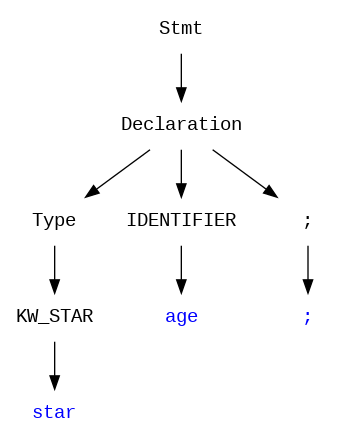
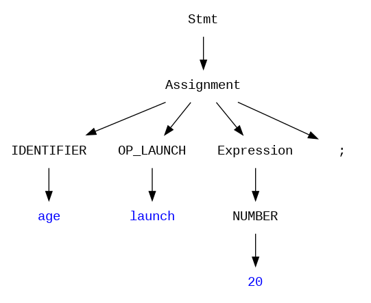

# COMPILER CONSTRUCTION – PHASE 02 REPORT

**Syntax Analyzer (Parser) Implementation**

* Project Name: COSMOS (Astrophysics-Themed Language)
* Student Name: Usman Shahid
* Roll No: L1F22BSCS1057
* Section: G-10
* Link For GitHub Repo: https://github.com/usman-s-mahmood/compiler-construction-project-cosmos

---

## 1. Project Objective

The objective of Phase 02 is to implement a **Syntax Analyzer (Parser)** using  **YACC/Bison** . This parser validates the grammatical structure of the COSMOS language, ensuring that the source code conforms to the rules defined in the Context-Free Grammar (CFG).

This phase integrates the **Lexical Analyzer** (Phase 01) with the Parser. The Scanner reads the source file and returns tokens (e.g., `KW_ORBIT`, `OP_LAUNCH`), while the Parser consumes these tokens to verify syntactic correctness, such as matching braces `{}`, verifying loop structures, and ensuring correct statement termination.

---

## 2. Context-Free Grammar (CFG)

The following production rules are derived from the `parser.y` file. They define the legal structure of a COSMOS program.

Terminal Symbols (Keywords & Operators):

$\mathbf{universe}, \mathbf{star}, \mathbf{planet}, \mathbf{galaxy}, \mathbf{orbit}, \mathbf{gravity}, \mathbf{lightyear}, \mathbf{observe}, \mathbf{supernova}$

$\mathbf{launch}, \mathbf{fusion}, \mathbf{collapse}, \mathbf{radiate}, \mathbf{expand}, \mathbf{::}, \mathbf{;}, \mathbf{\{}, \mathbf{\}}, \mathbf{(}, \mathbf{)}$

### **Production Rules**

$$
\begin{aligned}
\text{Program} &\to \mathbf{universe} \ \text{id} \ \mathbf{(} \mathbf{)} \ \mathbf{\{} \ \text{StmtList} \ \mathbf{\}} \\
\text{StmtList} &\to \text{Stmt} \mid \text{Stmt} \ \text{StmtList} \\
\text{Stmt} &\to \text{Decl} \mid \text{Assign} \mid \text{Cond} \mid \text{Loop} \mid \text{Output} \mid \text{Return} \\
\text{Decl} &\to \text{Type} \ \text{id} \ \mathbf{;} \\
\text{Type} &\to \mathbf{star} \mid \mathbf{planet} \mid \mathbf{galaxy} \mid \mathbf{cosmic} \\
\text{Assign} &\to \text{id} \ \mathbf{launch} \ \text{Expr} \ \mathbf{;} \\
\text{Cond} &\to \mathbf{orbit} \ \mathbf{(} \text{Expr} \mathbf{)} \ \mathbf{\{} \ \text{StmtList} \ \mathbf{\}} \\
&\quad \mid \mathbf{orbit} \ \mathbf{(} \text{Expr} \mathbf{)} \ \mathbf{\{} \ \text{StmtList} \ \mathbf{\}} \ \mathbf{gravity} \ \mathbf{\{} \ \text{StmtList} \ \mathbf{\}} \\
\text{Loop} &\to \mathbf{lightyear} \ \mathbf{(} \text{Expr} \mathbf{)} \ \mathbf{\{} \ \text{StmtList} \ \mathbf{\}} \\
\text{Output} &\to \mathbf{observe} \ \text{OutValues} \ \mathbf{;} \\
\text{Return} &\to \mathbf{supernova} \ \text{Expr} \ \mathbf{;} \\
\text{Expr} &\to \text{Expr} \ op \ \text{Expr} \mid \mathbf{(} \text{Expr} \mathbf{)} \mid \text{id} \mid \text{num}
\end{aligned}
$$

---

## 3. FIRST and FOLLOW Sets

These sets are crucial for determining how the parser chooses which rule to apply.

### **Non-Terminal: Program**

* **FIRST(Program)** = **$\{ \mathbf{universe} \}$**
  * *Reasoning:* A COSMOS program *must* strictly begin with the `universe` keyword.
* **FOLLOW(Program)** = **$\{ \$ \}$** (End of Input)
  * *Reasoning:* The program non-terminal represents the entire file.

### **Non-Terminal: Stmt (Statement)**

* **FIRST(Stmt)** = **$\{ \mathbf{star}, \mathbf{planet}, \mathbf{galaxy}, \mathbf{cosmic}, \mathbf{id}, \mathbf{orbit}, \mathbf{lightyear}, \mathbf{observe}, \mathbf{supernova} \}$**
  * *Reasoning:* These are the first tokens of valid statements (declarations start with types, assignments with IDs, etc.).
* **FOLLOW(Stmt)** = **$\{ \mathbf{star}, \mathbf{planet}, \dots, \mathbf{supernova}, \mathbf{\}} \}$**
  * *Reasoning:* A statement is followed by the start of the *next* statement, or the closing brace `}` of the current block.

---

## 4. Implementation Details & Integration

To satisfy the "Phase 01 Dependency" requirement:

1. **Token Sharing:** The `y.tab.h` header file generated by Bison is included in `scanner.l`. This ensures that when the scanner returns `KW_ORBIT`, the parser understands it as the integer token ID for `orbit`.
2. **Return vs. Print:** The Phase 01 `printf` statements in the scanner were replaced with `return TOKEN_NAME;`.
3. **Error Reporting:** A global `line_num` variable is maintained in the scanner and accessed by the parser's `yyerror()` function to report the exact location of syntax errors.

---

## 5. Parse Tree Visualization

Below are visual representations of how the COSMOS parser deconstructs code.

### **Example 1: Variable Declaration**

**Code:** `star age;`

 

### **Example 2: Assignment Statement**

**Code:** `age launch 20;`

 

## 6. Test Cases & Results

### **6.1 Valid Program**

**Input:** `source.csms`

**C++**

```
universe main() {                     
    star age;
    planet distance;
    galaxy message;
  
    observe "Calculating cosmic distance...";
  
    distance launch 9.46073e15;       
    age launch 13800000000;           
  
    distance launch distance radiate 3;   
    distance launch distance fusion 5.8786e12; 
  
    observe "Age of Universe: " age;
    observe "Distance traveled: " distance;
  
    orbit (age expand 10000000000) {  
        observe "We are in the Stelliferous Era!";
    } gravity {
        observe "Entering Black Hole Era...";
    }
  
    supernova 0;                      
}                                       
```

**Compiler Output:**

 

## 7. Conclusion

The Phase 02 Syntax Analyzer successfully implements the Context-Free Grammar for the COSMOS language. It correctly handles nested structures, operator precedence (via `%left` rules in Bison), and validates the custom keywords defined in the project proposal. The integration with the Flex scanner is seamless, ensuring zero token mismatches.
